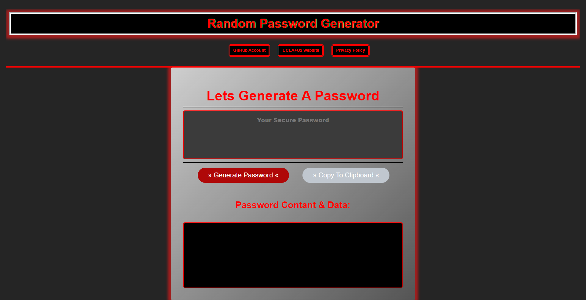
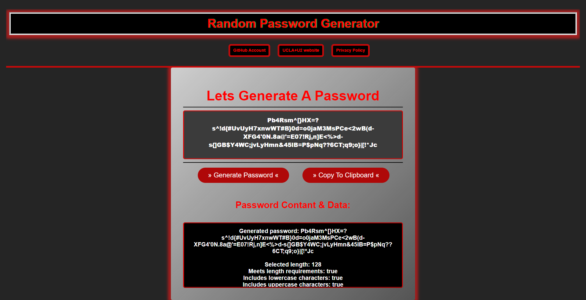

# Password Generator - Version 2.0.0

Generating a password when the user presses "Generate Password". A JavaScript prompt will ask the user will then be prompted to choose the length the password they want to generate, from 8 characters to 128 characters. The user will then be prompted to choose the type of characters they want to use. The user will then be prompted to choose the number of passwords they want to generate.
The user will then be prompted to choose the number of passwords they want to generate.

```
 possible characters = ABCDEFGHIJKLMNOPQRSTUVWXYZabcdefghijklmnopqrstuvwxyz0123456789!@#$%^&*()_+-=[]{}|;':,./<>?
```

This is an object oriented program that uses JavaScript classes.
HTML and CSS are used to create the user interface.

## Link to Program:

[GitHub Repo Link](https://github.com/Niksharpkings/password-generator)
[GitHub Pages Live Depoloyed Site Link](https://niksharpkings.github.io/password-generator/)

### Site View:




## Site View (Active Password Generated):



### Language:

 html5, css3, js, json, git, markdown, & txt

#### Criteria for Generating the Password:

// GIVEN I need a new, secure password
// WHEN I click the button to generate a password
// THEN I am presented with a series of prompts for password criteria
// WHEN prompted for password criteria
// THEN I select which criteria to include in the password
// WHEN prompted for the length of the password
// THEN I choose a length of at least 8 characters and no more than 128 characters
// WHEN asked for character types to include in the password
// THEN I confirm whether or not to include lowercase, uppercase, numeric, and/or special characters
// WHEN I answer each prompt
// THEN my input should be validated and at least one character type should be selected
// WHEN all prompts are answered
// THEN a password is generated that matches the selected criteria
// WHEN the password is generated
// THEN the password is either displayed in an alert or written to the page

## Dir/Path Tree Structure:

```
password-generator
├─ .git
├─ .gitignore
├─ assets
│  ├─ css
│  │  └─ style.css
│  ├─ html
│  │  └─ privacy-policy.html
│  └─ js
│     └─ script.js
├─ CODEOWNERS
├─ favicon.ico
├─ index.html
├─ LICENSE
├─ manifest.json
├─ README.md
└─ robots.txt

```

## Version Patch Notes:

```
V2.0.0 - | March 24, 2023 | Revamped version - Redid the assignment from scratch and added my own twist to it.

V1.0.0 - | Initial Release
```
